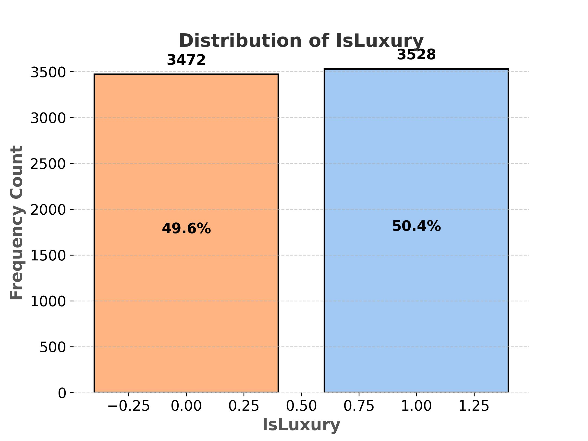
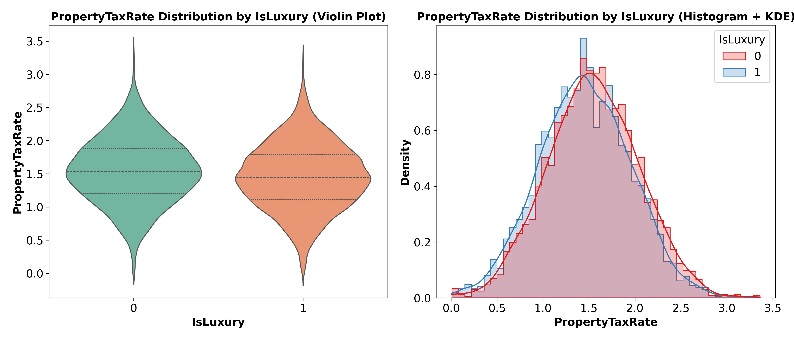
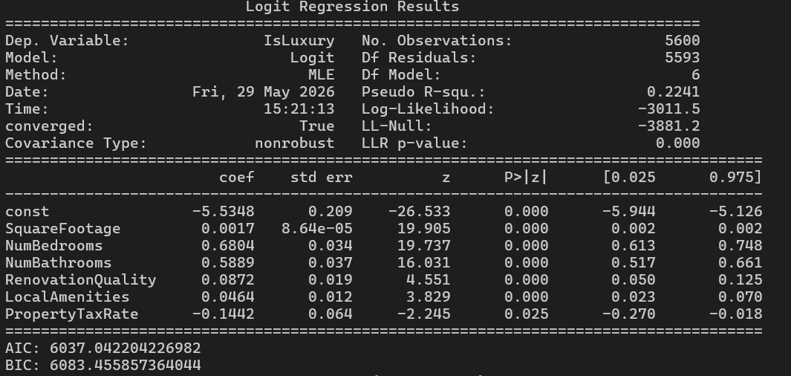
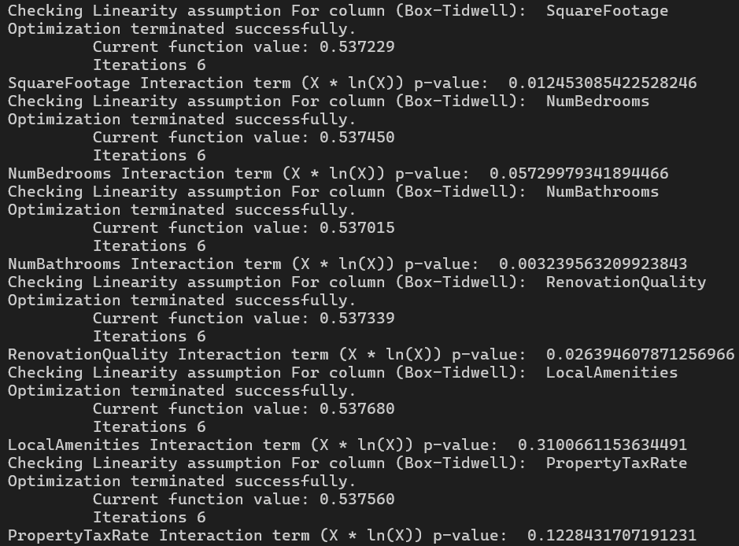
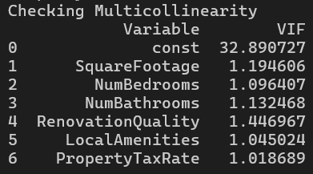
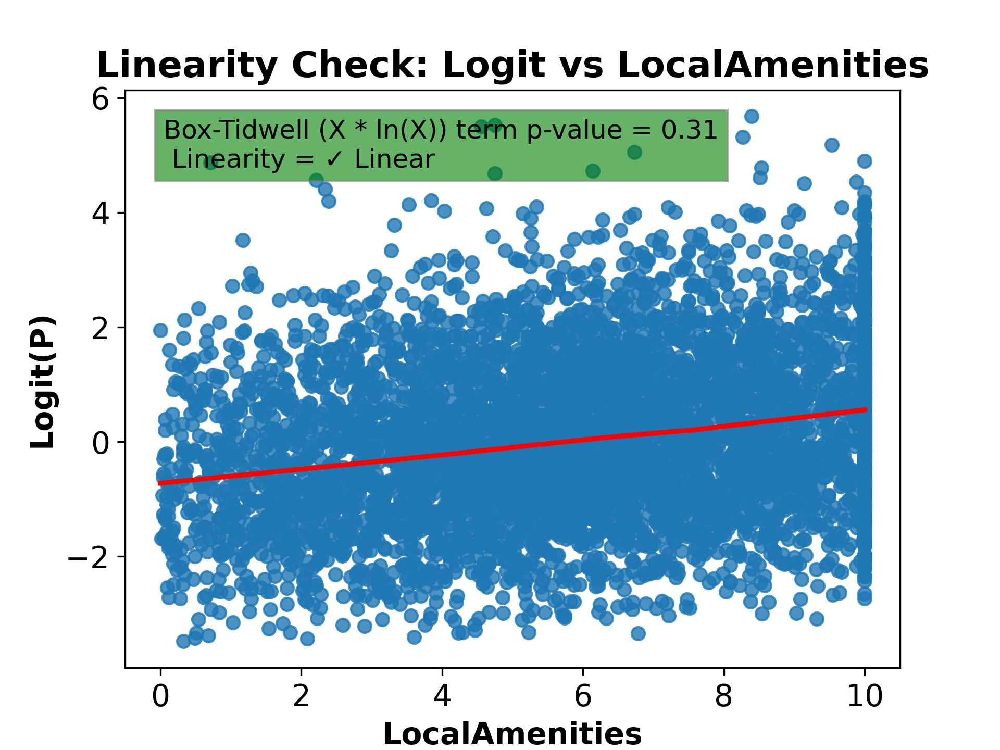
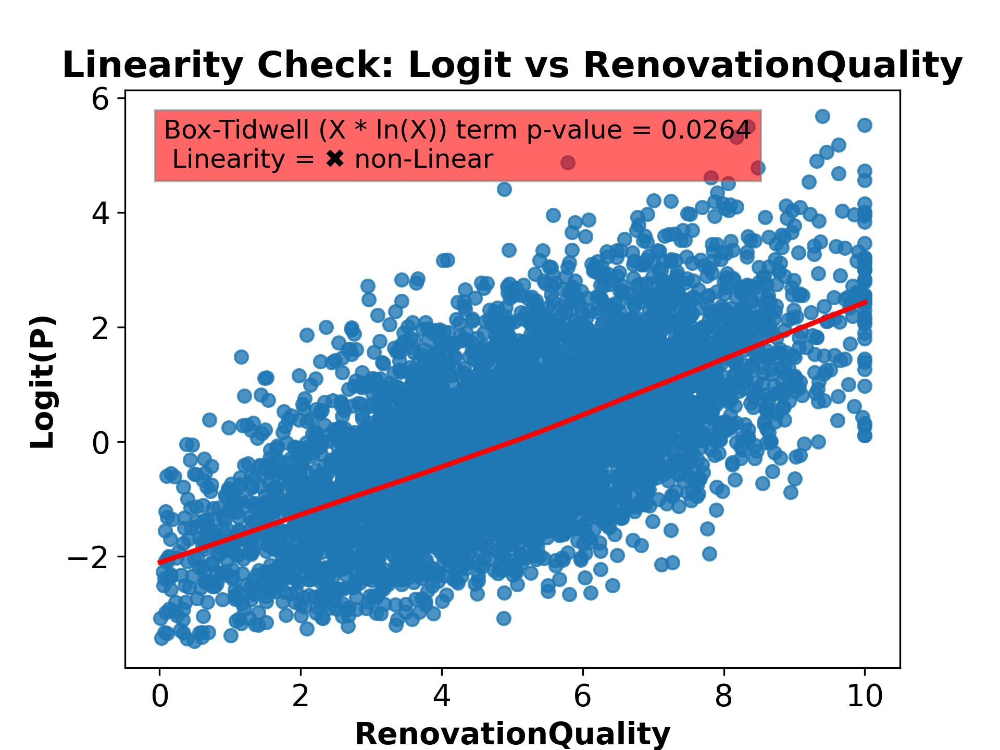
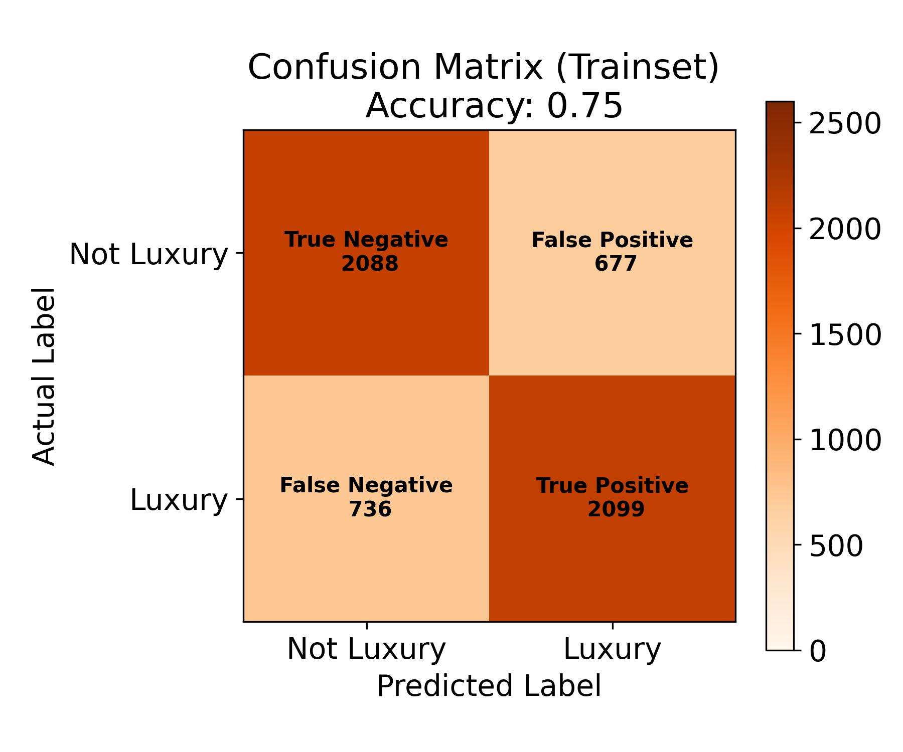
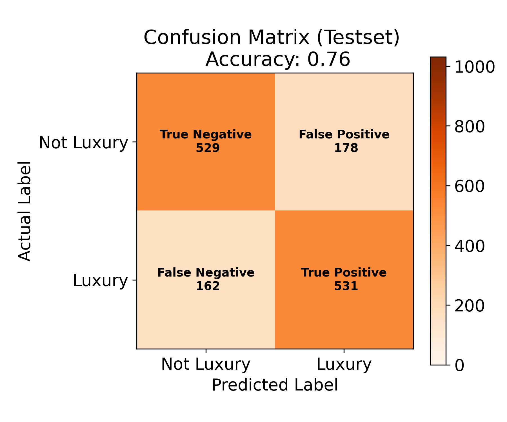

# Luxury Home Classification — Logistic Regression Analysis

This project builds a **logistic regression model** to predict whether a property is classified as luxury based on its physical features, location, and amenities. Using forward stepwise selection, the analysis identifies the most statistically significant predictors from 19 candidate variables and evaluates the model's classification performance on both training and test data.

The analysis covers:

- **Descriptive Statistics & Visualizations:** Univariate distributions and violin plots for all candidate predictors, split across luxury vs. non-luxury categories to highlight feature differences.
- **Feature Selection:** Forward stepwise selection based on p-value threshold (p < 0.05), converging on 6 significant predictors — validated against backward elimination which produced the same result.
- **Model Building & Evaluation:** Logistic regression evaluated using accuracy, confusion matrices on both training and test sets, and key stats including pseudo R², AIC/BIC, and LLR p-value.
- **Assumption Verification:** Binary dependent variable check, independence of observations, linearity of the logit (Box-Tidwell test + logit plots), and multicollinearity check via VIF scores.

> **Note on Dataset Availability**
> The raw CSV file has been removed from this repository as the data is proprietary and cannot be shared publicly. All descriptive visualizations and model outputs generated during the analysis have been retained in the `Figures/` folder for reference and presentation purposes.

---

## Analysis Summary

### Dependent Variable

`IsLuxury` — binary categorical variable (1 = Luxury, 0 = Not Luxury)

| IsLuxury Class Distribution |
|---|
|  |

---

### Independent Variables & Distributions

For each predictor, a violin plot and a histogram are generated, split by luxury status to reveal distributional differences between the two classes.

| Variable | Expected Relationship to Luxury |
|---|---|
| `SquareFootage` | Positive — larger homes tend to be luxury |
| `NumBedrooms` | Positive — more bedrooms indicate spaciousness |
| `NumBathrooms` | Positive — more bathrooms enhance comfort |
| `BackyardSpace` | Positive — expansive outdoor areas are common |
| `CrimeRate` | Negative — luxury areas tend to be safer |
| `SchoolRating` | Positive — top schools correlate with luxury neighborhoods |
| `AgeOfHome` | Negative — newer/renovated homes skew luxury |
| `DistanceToCityCenter` | Variable — prime urban or exclusive suburban locations |
| `EmploymentRate` | Positive — affluent markets have strong employment |
| `PropertyTaxRate` | Negative — balances prestige with cost |
| `RenovationQuality` | Positive — high-end finishes are a luxury hallmark |
| `LocalAmenities` | Positive — exclusive amenities define luxury communities |
| `TransportAccess` | Positive — upscale transport links add value |
| `Fireplace` | Positive — lifestyle feature common in luxury homes |
| `HouseColor` | Variable — curb appeal factor |
| `Garage` | Positive — multi-car garages are standard in luxury |
| `Floors` | Positive — multi-floor layouts signal luxury design |
| `Windows` | Positive — abundant windows = light and views |

| Sample Violin Plots (Predictors by Luxury Status) |
|---|
|  |

---

### Feature Selection — Forward Stepwise

The following 6 predictors were selected as statistically significant (p < 0.05):

```
SquareFootage, NumBedrooms, NumBathrooms,
RenovationQuality, LocalAmenities, PropertyTaxRate
```

| Logistic Regression Summary Output |
|---|
|  |

---

### Regression Equation

```
log(p / 1-p) = -5.535
             + 0.0017 × SquareFootage
             + 0.6804 × NumBedrooms
             + 0.5889 × NumBathrooms
             + 0.0872 × RenovationQuality
             + 0.0464 × LocalAmenities
             - 0.1442 × PropertyTaxRate
```

**Odds ratio highlights:**
- Each additional bedroom nearly **doubles** the odds of luxury classification (×1.97)
- Each additional bathroom multiplies odds by **×1.80**
- Each unit increase in property tax rate reduces odds by **~13.4%**

---

### Assumption Checks

| Check | Method | Result |
|---|---|---|
| Binary DV | Inspection | ✓ Met |
| Independence | Data structure review | ✓ Met |
| Linearity of logit | Box-Tidwell test + logit plots | Partially met — a few predictors flagged |
| Multicollinearity | VIF scores | ✓ Met — all VIF well below threshold |

| Box-Tidwell Test Results | VIF Scores |
|---|---|
|  |  |

| Logit Plots Linear | Logit Plot Non-Linear |
|---|---|
|  |  |

---

### Model Performance

| Metric | Training Set | Test Set |
|---|---|---|
| Accuracy | 0.75 | 0.76 |
| Pseudo R² | 0.224 | — |
| LLR p-value | 0.000 | — |

Training and test accuracy are nearly identical, indicating strong generalization with no overfitting.

| Confusion Matrix — Training Set | Confusion Matrix — Test Set |
|---|---|
|  |  |

---

## How to Run

### Prerequisites

```bash
pip install -r requirements.txt
```

### Dataset Setup

Place the dataset CSV inside the `data/` folder:

```
project/
├── data/
│   └── your_dataset.csv        ← put it here
├── main.py
├── requirements.txt
└── README.md
```

### Run

```bash
python main.py
```

The script handles all descriptive analysis, feature selection, model training, assumption verification, and visualization steps automatically. All outputs and plots are saved to the `Figures/` folder.

---

## Project Structure

```
project/
├── data/                   # Raw input dataset (not included — see note above)
├── Figures/                 # Generated plots and model results
├── main.py                 # Entry point — run this
├── requirements.txt
└── README.md
```

## Key Libraries Used

| Library | Purpose |
|---|---|
| `pandas` | Data manipulation |
| `numpy` | Numerical operations |
| `matplotlib` / `seaborn` | Visualization |
| `scipy.stats` | Skewness, mode, Chi-square test |
| `statsmodels` | Logistic regression (Logit), model summary, MSE |
| `sklearn` | Train/test split |
